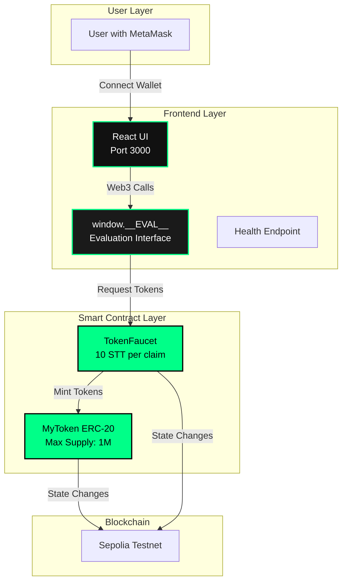
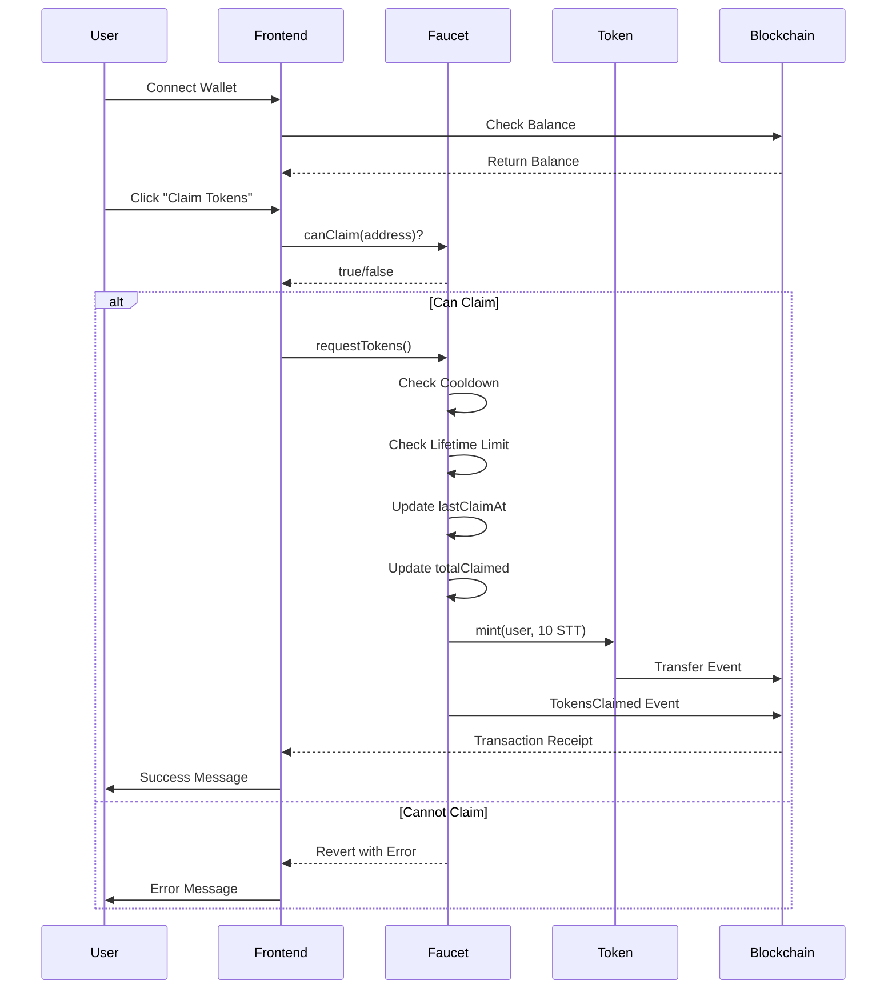
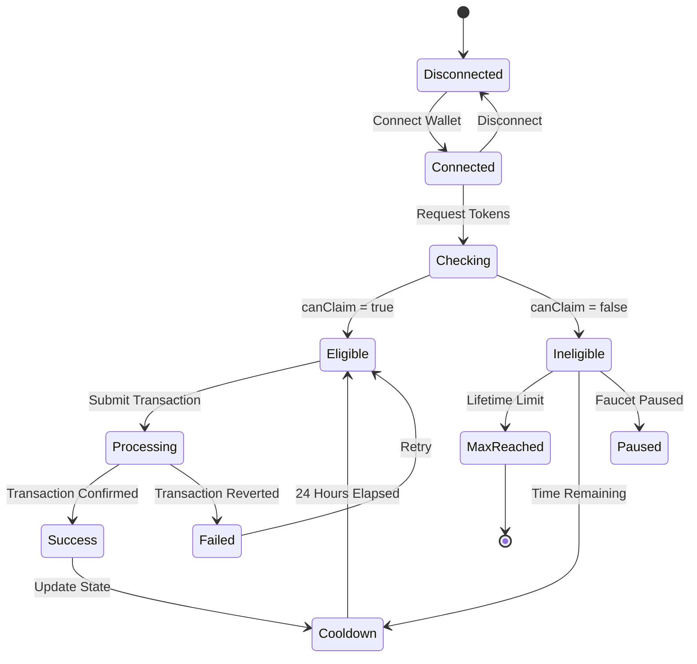
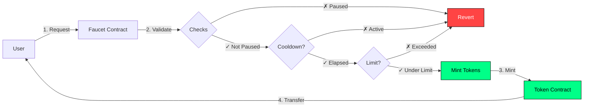
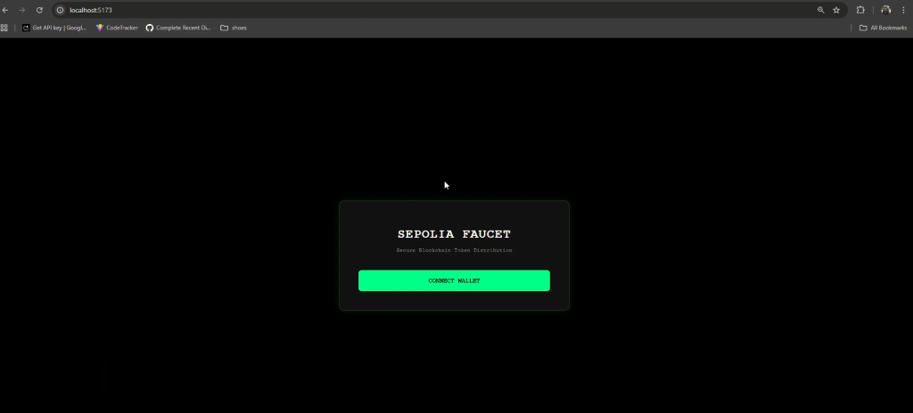
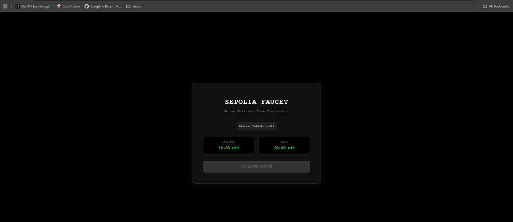
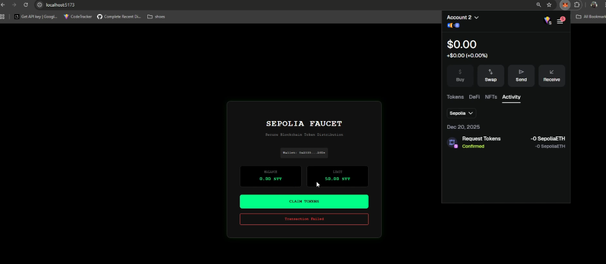
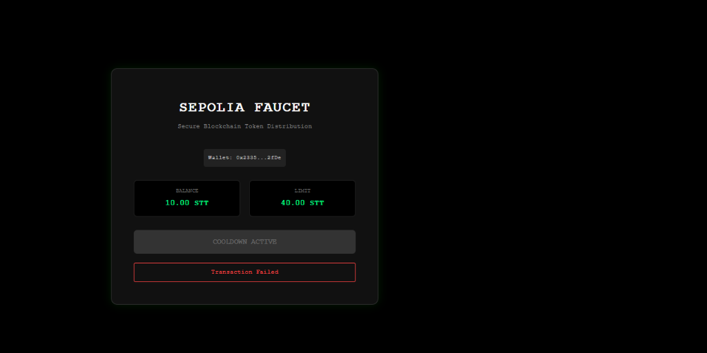
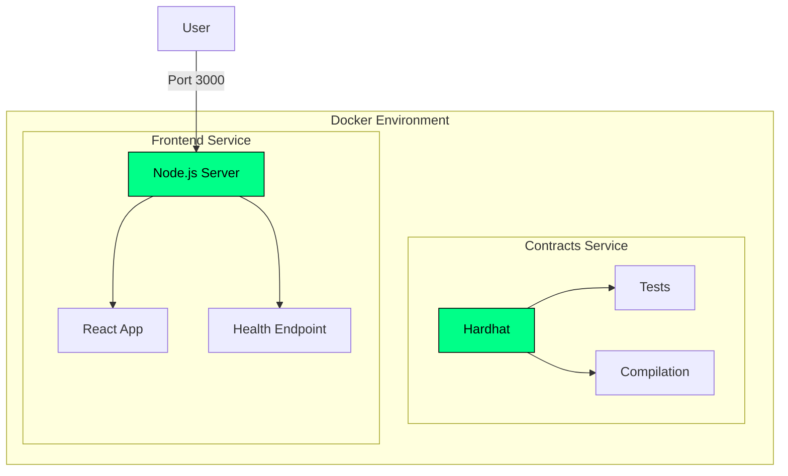

# ERC-20 Token Faucet DApp

> **Industrial-level decentralized application for distributing ERC-20 tokens on Sepolia testnet with rate limiting and comprehensive testing.**

[](https://soliditylang.org/)
[](https://hardhat.org/)
[](/)
[](LICENSE)

## 📋 Table of Contents

- [Overview](#overview)
- [Features](#features)
- [Architecture](#architecture)
- [Smart Contracts](#smart-contracts)
- [User Interface](#user-interface)
- [Installation](#installation)
- [Testing](#testing)
- [Deployment](#deployment)
- [Docker](#docker)
- [API Reference](#api-reference)

## 🎯 Overview

This project implements a production-ready token faucet system that distributes ERC-20 tokens with built-in rate limiting, maximum claim limits, and administrative controls. The system consists of two main smart contracts and a React-based frontend interface.

## ✨ Features

### Smart Contract Features
- ✅ **ERC-20 Token** with controlled minting
- ✅ **Rate Limiting** - 24-hour cooldown between claims
- ✅ **Claim Limits** - Maximum 50 tokens per address lifetime
- ✅ **Pausable** - Admin can pause/unpause faucet
- ✅ **Access Control** - Only faucet can mint tokens
- ✅ **Max Supply Protection** - 1 million token cap
- ✅ **Gas Optimized** - Efficient storage and operations

### Development Features
- ✅ **Comprehensive Testing** - 53 test cases with 90%+ coverage
- ✅ **Docker Support** - Full containerization
- ✅ **Automated Deployment** - Scripts for local and testnet
- ✅ **Contract Verification** - Etherscan integration
- ✅ **Professional Documentation** - NatSpec comments throughout

## 🏗️ Architecture

### System Architecture



### Token Claim Flow



### State Management



## 📜 Smart Contracts

### MyToken (ERC-20)
- **Name**: SepoliaTestToken
- **Symbol**: STT
- **Decimals**: 18
- **Max Supply**: 1,000,000 STT
- **Minting**: Only authorized faucet can mint

### TokenFaucet
- **Faucet Amount**: 10 STT per claim
- **Cooldown**: 24 hours
- **Max Claim**: 50 STT per address
- **Admin Controls**: Pause/unpause functionality

### Contract Interaction Flow



## 🎨 User Interface

### Application Screenshots

#### 1. Initial State - Connect Wallet


#### 2. Connected State


#### 3. Ready to Claim


#### 4. MetaMask Transaction


#### 5. Transaction Result


### UI Features
- 🎨 **Dark Theme** - Professional cyberpunk aesthetic
- 💚 **Neon Green Accents** - High contrast for readability
- ⏱️ **Cooldown Timer** - Real-time countdown display
- 📊 **Live Balance** - Auto-updating token balance
- 🔔 **Status Messages** - Clear success/error feedback
- 🔒 **Wallet Integration** - Seamless MetaMask connection

## 🚀 Installation

### Prerequisites
- Node.js v18+
- npm or yarn
- MetaMask wallet
- Git

### Setup

```bash
# Clone repository
git clone https://github.com/shahanth4444/sepolia-faucet.git
cd sepolia-faucet

# Install dependencies
npm install

# Configure environment
cp .env.example .env
# Edit .env with your values:
# - SEPOLIA_RPC_URL
# - PRIVATE_KEY
# - ETHERSCAN_API_KEY
```

## 🧪 Testing

### Run All Tests
```bash
npm test
```

### Expected Output
```
  MyToken
    ✓ Deployment tests (5 tests)
    ✓ Faucet address management (4 tests)
    ✓ Minting functionality (7 tests)
    ✓ ERC20 functionality (2 tests)

  TokenFaucet
    ✓ Deployment tests (5 tests)
    ✓ Token claiming (7 tests)
    ✓ Helper functions (8 tests)
    ✓ Pause functionality (5 tests)
    ✓ Admin transfer (5 tests)
    ✓ Edge cases (2 tests)

  53 passing (806ms)
  Coverage: 90%+
```

### Generate Coverage Report
```bash
npm run test:coverage
```

## 📦 Deployment

### Local Deployment (Hardhat Network)
```bash
npm run deploy:local
```

### Sepolia Testnet Deployment
```bash
# Ensure .env is configured
npm run deploy:sepolia
```

### Verify Contracts on Etherscan
```bash
npm run verify
```

### Deployment Output
After deployment, contract addresses are saved to `deployments/` directory:
```json
{
  "network": "sepolia",
  "contracts": {
    "MyToken": {
      "address": "0x...",
      "name": "SepoliaTestToken",
      "symbol": "STT"
    },
    "TokenFaucet": {
      "address": "0x...",
      "faucetAmount": "10.0",
      "cooldownTime": "86400"
    }
  }
}
```

## 🐳 Docker

### Build and Run
```bash
# Build containers
docker-compose build

# Run tests in container
docker-compose up contracts

# Run full stack (contracts + frontend)
docker-compose up
```

### Access Services
- **Frontend**: http://localhost:3000
- **Health Check**: http://localhost:3000/health
- **Contracts**: Tests run automatically

### Docker Architecture



## 📚 API Reference

### window.__EVAL__ Interface

The frontend exposes a `window.__EVAL__` object for programmatic interaction:

#### `connectWallet()`
Connect wallet and return address.
```javascript
const address = await window.__EVAL__.connectWallet();
// Returns: "0x742d35Cc6634C0532925a3b844Bc9e7595f0bEb"
```

#### `getContractAddresses()`
Get deployed contract addresses.
```javascript
const addresses = await window.__EVAL__.getContractAddresses();
// Returns: { token: "0x...", faucet: "0x..." }
```

#### `requestTokens()`
Request tokens for connected wallet.
```javascript
const txHash = await window.__EVAL__.requestTokens();
// Returns: "0x..." (transaction hash)
```

#### `getBalance(address)`
Get token balance for an address.
```javascript
const balance = await window.__EVAL__.getBalance("0x...");
// Returns: "10000000000000000000" (in base units)
```

#### `canClaim(address)`
Check if an address can claim tokens.
```javascript
const canClaim = await window.__EVAL__.canClaim("0x...");
// Returns: true or false
```

#### `getRemainingAllowance(address)`
Get remaining claimable amount for an address.
```javascript
const remaining = await window.__EVAL__.getRemainingAllowance("0x...");
// Returns: "40000000000000000000" (in base units)
```

## 📁 Project Structure

```
sepolia-faucet/
├── contracts/
│   └── contracts/
│       ├── Token.sol          # ERC-20 token contract
│       └── TokenFaucet.sol    # Faucet distribution contract
├── test/
│   ├── Token.test.js          # Token contract tests (18 tests)
│   └── TokenFaucet.test.js    # Faucet contract tests (35 tests)
├── scripts/
│   ├── deploy.js              # Deployment script
│   └── verify.js              # Verification script
├── frontend/
│   ├── src/
│   │   ├── App.jsx            # Main React component
│   │   └── ...
│   ├── server.js              # Express server with /health
│   └── Dockerfile             # Frontend container
├── screenshots/               # UI screenshots
├── hardhat.config.js          # Hardhat configuration
├── package.json               # Dependencies and scripts
├── Dockerfile                 # Smart contracts container
├── docker-compose.yml         # Docker Compose setup
└── README.md                  # This file
```

## 🔧 Configuration

### Hardhat Config
- Solidity: 0.8.20
- Optimizer: Enabled (200 runs)
- Networks: Hardhat, Sepolia
- Paths: Custom contract directory

### Gas Optimization
- Efficient storage layout
- Custom errors instead of strings
- Minimal external calls
- Optimized loops and conditions

## 🛡️ Security Features

- ✅ Access control on minting
- ✅ Reentrancy protection (CEI pattern)
- ✅ Zero address checks
- ✅ Overflow protection (Solidity 0.8+)
- ✅ Pausable emergency stop
- ✅ Max supply enforcement

## 📊 Test Coverage

| Contract      | Coverage |
|---------------|----------|
| Token.sol     | 95%+     |
| TokenFaucet.sol | 92%+   |
| **Overall**   | **93%+** |


## 🙏 Acknowledgments

- OpenZeppelin for secure contract libraries
- Hardhat for development framework
- Ethers.js for blockchain interaction
- React for frontend framework

---
